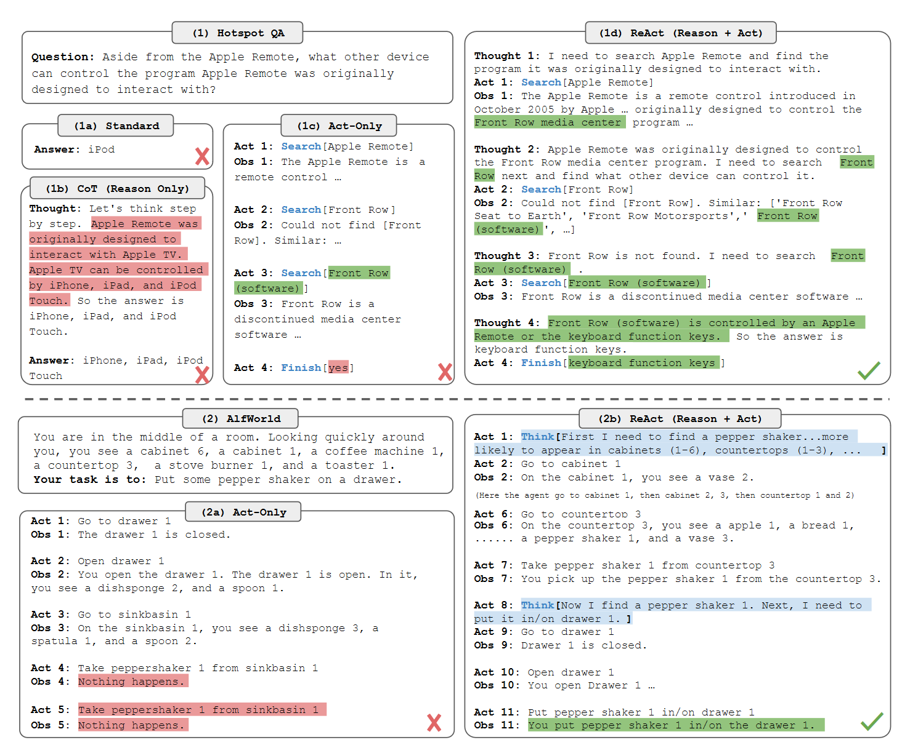

# 1.TinyAgent
基于React的方式，手动制作了一个最小的Agent结构（其实更多的是调用工具）。
> 论文：ReAct: Synergizing Reasoning and Acting in Language Models
<div style="display: flex; justify-content: center;">
    
</div>

## 1.1构造InternLM2大模型

首先，还是先创建一个BaseModel类，我们可以在这个类中定义一些基本的方法，比如chat方法和load_model方法，方便以后扩展使用其他模型。
```python
class BaseModel:
    def __init__(self, path: str = '') -> None:
        self.path = path

    def chat(self, prompt: str, history: List[dict]):
        pass

    def load_model(self):
        pass
```

接着，创建一个InternLM2类，这个类继承自BaseModel类，在这个类中实现chat方法和load_model方法。就和正常加载InternLM2模型一样，来做一个简单的加载和返回即可。

```python
class InternLM2Chat(BaseModel):
    def __init__(self, path: str = '') -> None:
        super().__init__(path)
        self.load_model()

    def load_model(self):
        print('================ Loading model ================')
        self.tokenizer = AutoTokenizer.from_pretrained(self.path, trust_remote_code=True)
        self.model = AutoModelForCausalLM.from_pretrained(self.path, torch_dtype=torch.float16, trust_remote_code=True).cuda().eval()
        print('================ Model loaded ================')

    def chat(self, prompt: str, history: List[dict], meta_instruction:str ='') -> str:
        response, history = self.model.chat(self.tokenizer, prompt, history, temperature=0.1, meta_instruction=meta_instruction)
        return response, history

```

## 1.2构造工具
在`tools.py`文件中，构造一个Tools类。为了在构造`system_prompt`的时候，让模型能够知道可以调用哪些工具，以及工具的描述信息和参数，我们需要添加一些工具（如Google搜索）的描述信息和具体实现方式。因此，
1. 首先要在 tools 中添加工具的描述信息
2. 然后在 tools 中添加工具的具体实现
```python
class Tools:
    def __init__(self) -> None:
        self.toolConfig = self._tools()
    
    def _tools(self):
        tools = [
            {
                'name_for_human': '谷歌搜索',
                'name_for_model': 'google_search',
                'description_for_model': '谷歌搜索是一个通用搜索引擎，可用于访问互联网、查询百科知识、了解时事新闻等。',
                'parameters': [
                    {
                        'name': 'search_query',
                        'description': '搜索关键词或短语',
                        'required': True,
                        'schema': {'type': 'string'},
                    }
                ],
            }
        ]
        return tools

    def google_search(self, search_query: str):
        pass
```

## 1.3构造Agent
在`Agent.py`文件中，构造一个基于React范式的Agent类，实现了一个对话方法text_completion方法，我们在这个方法中，调用InternLM2模型，然后根据React的Agent的逻辑，来调用Tools中的工具。

首先我们要构造system_prompt, 这个是系统的提示，我们可以在这个提示中，添加一些系统的提示信息，比如ReAct形式的prompt。

